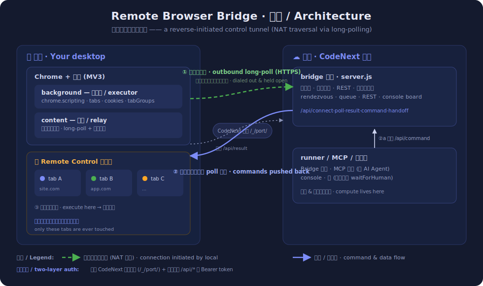

# Remote Browser Bridge

[简体中文](README.md) · **English**

    

Drive your **local** Chrome from a cloud IDE (**CodeNext**) or an **AI agent**, through a small
MV3 extension + a zero-dependency Node bridge. HTTP long-polling only, no WebSocket. The
extension touches **only** the tabs inside a tab group named `Remote Control` — everything else
is left alone.

> 💡 **In one line**: the compute lives in the cloud, the browser lives on your desk. It brings
> cloud code / AI agents to **the real, already-logged-in browser on your machine** — operating
> the web with **your session, your IP, your fingerprint**, instead of spinning up a fresh,
> empty browser in the cloud.

> 🚀 **Want to just run it? See [QUICKSTART.md](QUICKSTART.md)** — clone and follow along to
> deploy (covers token rules, running the service, and MCP setup).

---

## Highlights

- 🤖 **Built for AI agents (MCP)** — a zero-dependency MCP server lets Claude Code / Cursor etc.
  call tools like `browser_snapshot` / `browser_click` / `browser_type` directly and operate the
  web as you. See [mcp/README.md](mcp/README.md).
- 🎯 **Locators + auto-waiting (Playwright-style)** — `getByRole/getByText/getByLabel/getByTestId`
  or `locator({...})`; actions auto-wait for the element to appear → be visible → be enabled (no
  manual `sleep`), and pierce open Shadow DOM.
- 🧭 **Structured ref snapshot** — `snapshot_refs` tags every interactive element with a stable
  `[eN]` id; click/type by id instead of brittle CSS selectors. LLM-friendly.
- 🙋 **Human handoff + notifications** — on login / captcha, scripts/agents can `waitForHuman()`
  to pause; the console shows a banner and (optionally) pings DingTalk. You handle it, click
  “continue”, and it resumes. `pauseIfRisky()` auto-pauses when it detects anti-bot walls.
- 🖥️ **Background operation** — commands act on the “current target tab” **without stealing
  focus**; you can keep using other tabs/windows while it works in the background (only
  screenshots briefly switch, a Chrome limitation).
- 🔒 **Scoped & safe** — only tabs in the `Remote Control` group are ever driven.
- 🔑 **Enforced token auth** — every `/api/*` requires an auto-generated token; it’s embedded in
  the console page and carried automatically by the extension/frontend, and `runner.js` reads it
  from `.bridge-token` — so it’s invisible to you but strangers are rejected.
- 🧰 **40+ actions** — navigate, click/type/press-key, read DOM/text/HTML, wait for element/text,
  scroll, dismiss overlays, cookies, operate inside `iframe`s, run JS.
- 🌐 **Network control** — capture `fetch`/`XHR`, `waitForNetworkIdle()`, `route()` to mock/abort
  API responses, or send requests with the page’s own credentials (`networkFetch`).
- ✅ **Web-first assertions** — `expect(locator).toBeVisible()/toHaveText()/toBeChecked()…` that
  auto-retry until timeout.
- 🧩 **Dialog auto-handling + debug trace** — `handleDialogs()` auto-answers page
  `alert/confirm/prompt` so they don’t block; `startTrace()/saveTrace()` exports a step timeline
  (action / duration / pass-fail / optional screenshots).
- 🔴 **Codegen (record → script) + iframe piercing** — `startRecording()`, act manually, then
  `saveScript()` emits a runnable script; locators/snapshot pierce same-origin iframes.
- 🎨 **Canvas content extraction** — `readCanvasImage()` exports an already-rendered canvas as an
  image for a vision model to OCR (recommended, robust); or `install_resume_hook` intercepts
  `fillText` to rebuild structured text (timing-sensitive).
- 📊 **Console dashboard** — Tabs / Screenshot / Network / Cookies panels, quick buttons + a
  command toolbar.
- ⚙️ **Zero dependencies, two ways to script** — pure Node (`http`/`crypto`); flexible JS scripts
  or simple declarative JSON steps.

---

## Why it’s valuable

The value isn’t “it can drive a browser” (Puppeteer / Playwright do that) — it’s **which browser
it drives**: the Chrome on your desktop that is **already logged in, with real cookies / IP /
fingerprint**. What flows through the channel is **your browser identity**, not machine access.

Compared with the usual approaches:

| Dimension | **This project** | VNC / RDP | Headless (cloud Puppeteer) |
|---|---|---|---|
| Who drives whom | cloud code / agent → **drives your local browser** | you watch/control a remote screen | a fresh browser in the cloud |
| Session / 2FA | ✅ existing session, no re-login | ✅ (but on the remote machine) | ❌ must script login, hit 2FA |
| IP / fingerprint | ✅ your residential IP + real fingerprint, passes anti-bot naturally | the remote machine’s | ❌ datacenter IP, easily flagged |
| Callable by code / agents | ✅ structured API + MCP | ❌ pixels only | ✅ |
| Human in the loop | ✅ you can watch and take over anytime | ✅ but fully manual | ❌ |
| Attack surface | tiny: one tab group only | the whole machine | — |
| Network traversal | ✅ long-poll through a reverse proxy, no inbound port / VPN | needs a port / tunnel | cloud-local |

**Good for**: personal automation of sites you’re logged into; reading data behind a login wall;
semi-automated flows where you want to watch / occasionally take over; giving a cloud AI agent “a
hand that uses your browser”.

**Not for**: large-scale, unattended scraping of public data (use a headless cluster); or
“seeing / operating the remote machine itself” (use VNC / RDP).

---

## Architecture & how it works

It is **not proxying a machine back to you** — it’s a **reverse-initiated control tunnel narrowed
to one capability: “run browser actions.”** The key point: the cloud **can’t reach** your desktop
(you’re behind NAT / a firewall with no public IP), so **your local extension dials out** and
holds a long-poll open; commands are then pushed back down that already-open outbound connection —
the same idea as a reverse SSH tunnel / `ngrok` / a webhook relay.



**① Transport: HTTP long-polling (no WebSocket)** — the extension `POST /api/connect` for a
`browserId`, then `GET /api/poll`, which the server holds open for up to 25s: it returns
immediately when a command arrives, otherwise returns empty and the extension polls again. A cloud
`POST /api/command` blocks server-side until the extension polls → executes → `POST /api/result`,
then returns — so it feels like a synchronous RPC to the caller. Long-poll (not WS) is chosen
because plain GET / POST sails cleanly through any HTTP reverse proxy (CodeNext’s `/_/port/`) and
corporate proxies, with no upgrade negotiation. **Here, “goes through anything” is a feature, not
a limitation.**

**② Direction inversion for NAT traversal** — the cloud can’t dial into your desktop, so the local
extension initiates the outbound connection and parks a poll; the control direction (cloud →
local) rides that locally-initiated connection.

**③ Injected into the console page → auth for free** — the relay `content.js` only activates on the
bridge console page (detected via an injected `<meta name="remote-bridge-console">`). Running
there, its `fetch` is **same-origin** with the bridge server and automatically carries CodeNext’s
login cookies — so it transparently passes CodeNext’s own auth proxy (a request from any other
page would be cross-origin and blocked).

**④ Execution path** — relay (page) → `chrome.runtime.sendMessage` → background service worker →
lands via `chrome.scripting.executeScript` (DOM ops / ref snapshot / canvas·network hooks run in
the **MAIN world**), `chrome.tabs`, `chrome.cookies`, `chrome.tabGroups` — **only touching the
`Remote Control` group**.

**⑤ Two-layer auth** — outer: CodeNext’s own login proxy (`/_/port/`); inner: a Bearer token on
every `/api/*` (embedded in the console page, carried automatically).

### Code layout

- **`extension/`** — Chrome MV3 extension (unpacked source; load via “Load unpacked”)
- **`server/server.js`** — bridge server: rendezvous + REST API + console dashboard (zero-dep)
- **`server/runner.js`** — automation engine (the `Bridge` class + CLI)
- **`server/notify.js`** — DingTalk notifications (zero-dep)
- **`mcp/server.js`** — MCP server for AI agents ([docs](mcp/README.md))
- **`examples/`** — generic examples ([guide & API reference](examples/README.md))

---

## Security model

- **Only the controlled group**: the extension drives only tabs in the `Remote Control` group.
- **Enforced token auth**: every `/api/*` endpoint requires an auto-generated token; it’s embedded
  in the console page and carried by the extension/frontend automatically, and same-machine
  `runner.js` reads it from `.bridge-token` — invisible to you, but anyone without the token is
  rejected.
- **All console output is escaped**, so a malicious page title can’t inject script.
- ⚠️ This tool can read the controlled tabs’ cookies and run JS. Do not expose the service to
  untrusted networks: for local-only use set `BRIDGE_HOST=127.0.0.1`; when accessed via CodeNext,
  rely on its built-in login auth layer.

---

## Install & use

### 1. Install the Chrome extension

1. Open `chrome://extensions`, enable **Developer mode** (top-right).
2. Click **Load unpacked** and select the repo’s **`extension/`** folder.

### 2. Start the bridge server (from the **repo root**)

```bash
npm start                 # = node server/server.js, default port 3006

# background:
# nohup npm start > /tmp/bridge.log 2>&1 &
```

> Start from the repo root so the token (`.bridge-token`) lands there and runner / MCP pick it up
> automatically. See [QUICKSTART.md](QUICKSTART.md) §4.

Environment variables:

| Variable | Default | Meaning |
|------|------|------|
| `BRIDGE_PORT` | `3006` | listen port |
| `BRIDGE_HOST` | `0.0.0.0` | listen interface; use `127.0.0.1` for local-only (safer) |
| `BRIDGE_TOKEN` | auto | auth token; if unset, one is generated and written to `.bridge-token` |

### 3. Connect

1. Open the console page:
   - CodeNext: `https://your-domain/_/port/3006/`
   - Local: `http://localhost:3006/`
2. Click the extension icon in Chrome’s toolbar, paste the console URL → **💾 Save** →
   **🔗 Open console** (the token is already embedded in the page — no need to enter it).

### 4. Create the controlled tab group

Right-click any tab in Chrome → **Add tab to new group**, rename the group to **`Remote Control`**
(exact match), then drag the sites you want to automate into it. You can also run `create_group`
from the console.

Once connected, the console’s left panel lists the controlled tabs and the top-right shows 🟢
Connected. Click “📸 Screenshot” to test.

---

## Run automation

```bash
# JS script (recommended)
node server/runner.js examples/quickstart.js
node server/runner.js examples/quickstart.js https://news.ycombinator.com

# declarative JSON
node server/runner.js examples/demo.json

# specify port / token (usually unneeded on the same machine — token is read from .bridge-token)
node server/runner.js examples/quickstart.js --port=3006 --token=xxx
```

Full API list and how to write scripts: **[examples/README.md](examples/README.md)**.

---

## For AI agents (MCP)

A built-in zero-dependency MCP server lets Claude Code / Claude Desktop / Cursor etc. drive your
browser directly. Prerequisite: the bridge server is running and the extension is connected. Add
this to the client’s `mcpServers`:

```json
{
  "mcpServers": {
    "browser": {
      "command": "node",
      "args": ["/absolute/path/remote-browser-bridge/mcp/server.js"],
      "env": { "BRIDGE_PORT": "3006", "BRIDGE_TOKEN": "see the bridge startup log" }
    }
  }
}
```

Provides `browser_snapshot` / `browser_navigate` / `browser_click` / `browser_type` /
`browser_screenshot` / `browser_wait_for_human` and more. See **[mcp/README.md](mcp/README.md)**.

---

## Human handoff + DingTalk notifications

When a script or agent hits something only a human should do (login, captcha, confirmation), it
can pause and wait for you:

```js
// unconditionally ask for a human; blocks until you click “continue” in the console
await bridge.waitForHuman('Please log in in the browser, then click Continue');

// or: pause only when anti-bot / captcha is detected
await bridge.pauseIfRisky();
```

This pops a **handoff banner at the top of the console** ([Continue] / [Cancel]) and (if DingTalk
is configured) sends a notification. In MCP this is `browser_wait_for_human`.

Configure DingTalk (optional, a robot webhook) — set env vars before starting runner / MCP:

```bash
export DINGTALK_WEBHOOK="https://oapi.dingtalk.com/robot/send?access_token=xxx"  # or just the access_token
export DINGTALK_SECRET="signing-secret"   # if the robot uses the “sign” security mode
# keyword security is also supported: export DINGTALK_KEYWORD="notice"
```

When unconfigured, notifications are silently skipped and the handoff banner still works. See
[examples/handoff.js](examples/handoff.js).

---

## Notes

- **Background operation**: commands act on the “current target tab” without bringing it to the
  foreground — you can use other tabs/windows meanwhile. `switch_tab` brings it to front;
  `screenshot` briefly switches and switches back (Chrome limitation). See CHANGES.md (v1.5.0).
- The extension pushes controlled-tab info to the console every 30s (and immediately on page
  changes).
- The bridge drops a session after 90s without a heartbeat; refresh the console page to reconnect
  after a restart.
- All fixes relative to the original v1.3.0 are in **[CHANGES.md](CHANGES.md)**.

---

## FAQ

**Extension shows “disconnected” / won’t connect?**
- Check the console URL is exact (`.../3006/`, note the trailing slash) and the server is running.
- Make sure the `Remote Control` group exists (exact name), or run `create_group` in the console.
- After changing the extension, **reload it** in `chrome://extensions` and **refresh the console
  page**.

**runner / commands return `401 unauthorized`?**
- Token mismatch. `runner.js` reads `.bridge-token` from its working directory by default — run it
  **from the server’s working directory**, or set `BRIDGE_TOKEN` / pass `--token=xxx`. The console
  page embeds the token automatically.

**Port isn’t 3006?**
- Change it with `BRIDGE_PORT`; the port in the console URL and `runner --port` must match.

**Screen flickers during a screenshot?**
- Normal. `captureVisibleTab` can only capture the foreground tab, so it briefly activates the
  target tab and switches back (the result includes `refocused`).

**“This page can’t be scripted”?**
- Restricted pages (`chrome://`, the Chrome Web Store, etc.) can’t be injected. Use a normal page.

**Canvas text / network capture comes back empty?**
- Requires v1.4.0+ (hooks now run in the page’s **main world**); and install the canvas hook with
  `install_resume_hook` **before** the page starts drawing.

**Service worker keeps dying / page info stops updating?**
- MV3 recycles the SW; this project restores state via `storage.session` + `chrome.alarms`. Keep
  the console tab open.

**Multiple controlled tabs — which one do commands hit?**
- The “current target tab” (marked 🎯 in the sidebar). Use `set_target` (or click a tab in the
  console) to set the background target; `switch_tab` (or the ▶ button) brings it to front.

---

## Disclaimer

This tool operates **your own, already-logged-in** browser for development and automation. When
using it to visit any third-party site, follow that site’s Terms of Service, `robots` rules, and
local law; keep request rates reasonable; and only access data you’re authorized to. The author is
not responsible for misuse.

## License

[MIT](LICENSE) © 2026 zvv1999
